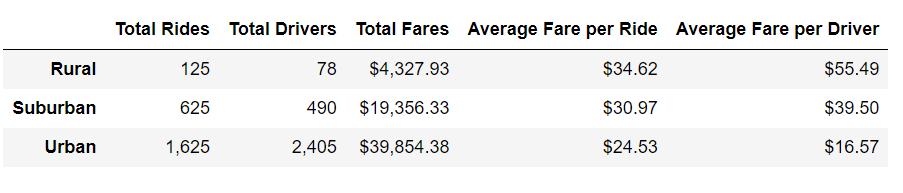
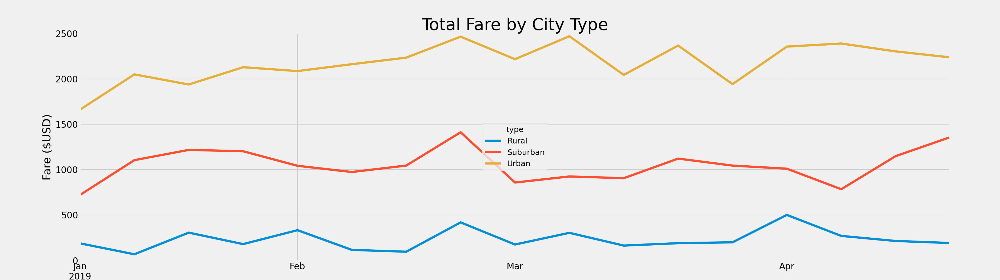

# PyBer_Analysis

You can find the analysis file here: [PyBer_Analysis](https://github.com/NedaAJ/PyBer_Analysis/blob/main/PyBer_Challenge.ipynb)

## Overview of Analysis
Th egoal of this challenge and analysis is to create a multiple-line graph that shows the total weekly fares for each city type: *Rural, Urban and Suburban*. In addition to the line chart, we create a summary dataframe of **total rides, total drivers, total fares, avergae fare per ride and average fare per driver**.
## Results
### Deliverable 1
From the summary dataframe (shown below), we can see a trend between the *population of city* and the *total number of rides* which has a direct effect on the **total number of drivers, total fares and average ride fare**. Even though the total number of rides, drivers and fares decrease as we move to further destinations from the urbanized areas, the **average fare per driver** and **per ride** seems to **increase** like in rural cities; *Less drivers* in rural areas lead to **a higher average fare per ride and driver**, as prices increase when supply is low.

### Deliverable 2

## Summary
